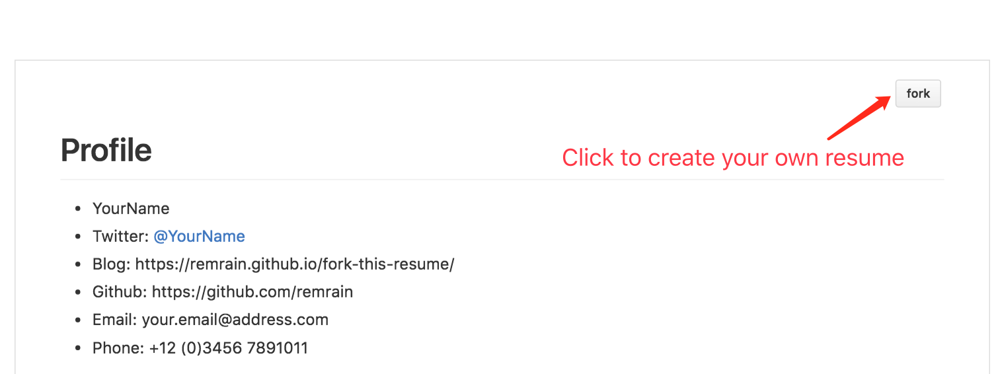

# Fork This Resume
[Fork This Resume](https://github.com/remrain/fork-this-resume) is a project to turn a markdown document into an elegant resume.
[source code](https://github.com/remrain/fork-this-resume)

To create your own resume, you can simply fork a published resume or template.

# Start with a template below
 - [Sample](https://remrain.github.io/fork-this-resume/#!/show/sample)
 - [中文简历模板](https://remrain.github.io/fork-this-resume/#!/show/sample-cn)

# Sample screenshot
 > 

# Export to PDF
You can convert web pages to PDF from popular browsers like Internet Explorer, Firefox and Chrome by installing a PDF creator that works as a virtual PDF printer. Once the printer is installed, you can simply print to it and a PDF file will be generated. 

 * Convert a web page to PDF from Google Chrome on MacOS:
     - Click **File** - **Print...** (or press ⌘+P)
     - Choose **Open PDF in Preview**

# License
Apache Licence 2.0
